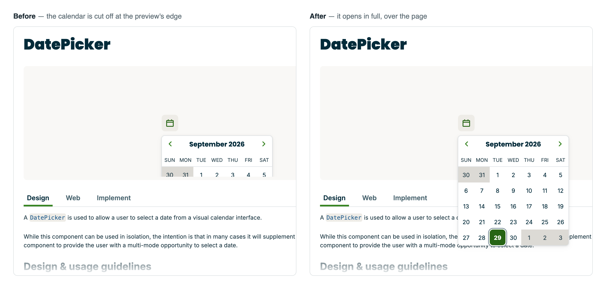
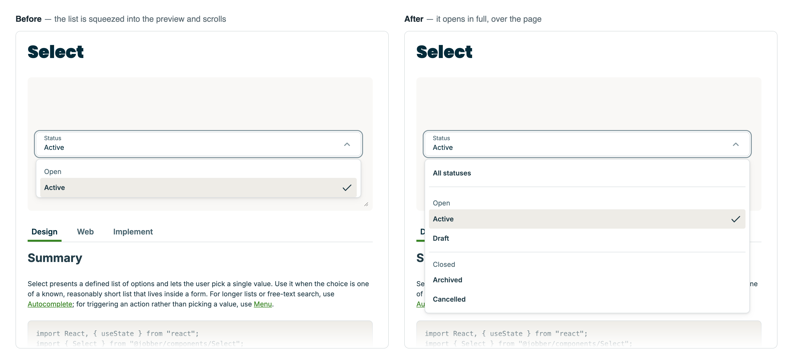

# Jobber Atlantis docs, with overlays that escape the preview iframe

An improved replica of [atlantis.getjobber.com](https://atlantis.getjobber.com), the docs of
Jobber's Atlantis design system. On the original site, menus, dropdowns, date pickers and drawers
opened in a live example are cut off or squeezed by the preview iframe; here they extend over the
page and close on a click anywhere on it, as if the example were not in an iframe at all.

**Live:** [jobber-atlantis-docs.pages.dev](https://jobber-atlantis-docs.pages.dev)

Everything else is as on the original: every page (components with their Design, Web, Mobile and
Implement tabs, patterns, content, design tokens, hooks, guides, packages, the changelog), the
navigation, search and theme toggle. Two parts rely on Jobber's own services: Triton, the AI
assistant, keeps its button and drawer but answers only on the original site, and the mobile
previews run on the original site's React Native Web bundle, which `npm run dev` and
`npm run build` download to `public/`.





## The fix

[`src/overlay-frame`](src/overlay-frame) is a standalone module with no dependencies. While an
overlay in the example does not fit the frame — cut off by it, or squeezed into it and scrolling —
the frame grows over the page, downwards and sideways as far as the page has room (the layout keeps
its resting size, so nothing around it moves), the example stays exactly where it was painted, and
presses on the page are replayed in the frame, so overlays close as they would without it. Design,
options and limits are in [its README](src/overlay-frame/README.md).

Integrating it takes two lines: the preview document ([`skeleton.ts`](src/preview/skeleton.ts)) adds
`overlayFrameGuestScript()`, and [`AtlantisPreviewViewer.tsx`](src/preview/AtlantisPreviewViewer.tsx)
renders `<OverlayFrame>` in place of the `<iframe>`.

## Run it

```bash
npm install
npm run dev                # http://localhost:5190
npm run verify             # scenario checks in headless Chrome, with the dev server running
npm run verify -- --phone  # the same in a phone-sized window, on the small-screen layout
npm run build              # typecheck, production build, then every page prerendered, with llms.txt
npx vite preview           # the production build, on http://localhost:4173
DOCS_URL=http://localhost:4173 npm run verify -- --components  # each component's check against it
```

`npm run verify` opens overlays in the live preview and checks that they are fully visible from the
first painted frame, that neither the example nor the page moves, and that a click outside closes
them — including resized previews, menus that flip, overlays past the preview's sides, scrollbars,
modal backdrops, edits and switching between the Web and Mobile tabs. The component checks also run
against the production build, whose minified code is what the preview frames get there.

The GIF search in the *Getting started with React* guide asks Giphy for its GIFs, with the key in
`VITE_GIPHY_API_KEY` (in `.env` locally, a repository secret for the deployed site).

## Speed

Every page is also built as an HTML file with its content in it: after the production build,
[`scripts/prerender.mjs`](scripts/prerender.mjs) renders each page in headless Chrome, at a phone's
width and at a desktop's (it finds Chrome where it is usually installed, or in `CHROME_PATH`, and
leaves pages to render in the browser without it). A visit shows that content at once and loads the
app after it; the app renders the page out of sight and takes its place once the page is ready.

The app itself loads in parts: a page's code, and a component's content, load with the page; Babel
compiles examples in a worker, off the page's main thread; the preview starts once the page's
document is in. The fonts are declared in the page's own stylesheet, Inter and Poppins served from
the site, so no other site's stylesheet holds up the first paint.

## Markdown

The prerender also reads each page's document for [llms.txt](https://llmstxt.org)
([`scripts/llms.mjs`](scripts/llms.mjs)): [`/llms.txt`](https://jobber-atlantis-docs.pages.dev/llms.txt)
lists the pages, a line on each, and links to their Markdown (`/components/Button.md`,
`/design/colors.md`...); [`/llms-full.txt`](https://jobber-atlantis-docs.pages.dev/llms-full.txt)
holds all of it. A component's Markdown has its design guidance, its implementation notes, and the
example and props of its Web and Mobile tabs. Examples keep their code, and a tab inside a document
comes with the others of its group.

## Deployment

Pushes to `main` build the site and deploy it to Cloudflare Pages
([workflow](.github/workflows/deploy.yml)); pull requests are only built. The workflow reads the
repository secrets `CLOUDFLARE_API_TOKEN` (a token with Account › Cloudflare Pages › Edit) and
`CLOUDFLARE_ACCOUNT_ID`.
